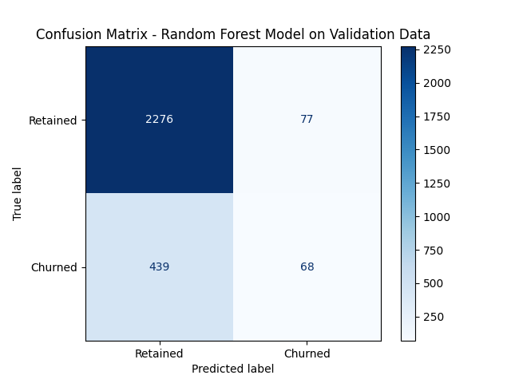
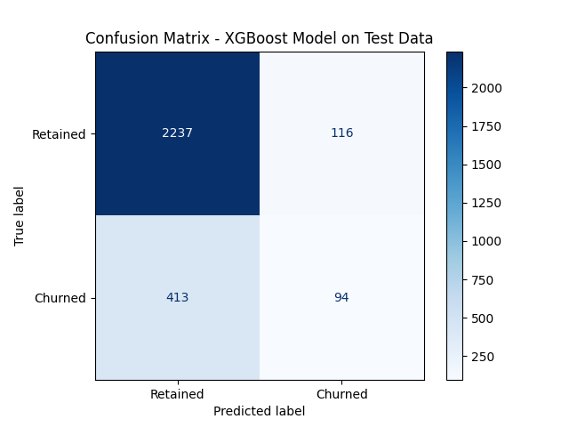

----
Waze Churn Prediction Project
---
----
**Table of Contents**

- [Objective](#Objective)
- [Dataset Overview](#Dataset-Overview)
- [Data Cleaning & Feature Engineering](#Data-Cleaning-&-Feature-Engineering)
- [Exploratory Data Analysis (EDA)](#Exploratory-Data-Analysis-(EDA))
- [Dataset Summary (Before Modeling)](#Dataset-Summary-(Before-Modeling))
- [Modeling](#Modeling)
- [Final Test Set Results (XGBoost with threshold tuning)](#Final-Test-Set-Results-(XGBoost-with-threshold-tuning))
- [Feature Importance (Top Predictors)](#Feature-Importance-(Top-Predictors))
- [Threshold Tuning Details](#Threshold-Tuning-Details)

##Objective
---

The goal of this project is to predict which users are likely to churn (i.e., stop using the Waze app) based on their behavior and usage patterns. The key business objective is to maximize recall for churned users to allow for early intervention.

##Dataset Overview
---

Initial Users: 14,999

Final Users (after cleaning): 14,299

Initial Features: 13 columns

Final Features after feature engineering: 20 columns

Target Variable: label (Retained / Churned)

Churn Rate: 17.7%
د

##Data Cleaning & Feature Engineering
---

Removed 700 users with missing target values.

Capped outliers using IQR in key columns like sessions, drives, duration_minutes_drives, etc.

Created 7 new features:

km_per_drive

km_per_driving_day

drives_per_driving_day

total_sessions_per_day

percent_sessions_in_last_month

percent_of_drives_to_favorite

professional_driver

##Exploratory Data Analysis (EDA)
---

Key Insights:

Retained users: 82.26% – Churned users: 17.74%

Churned users have slightly more sessions on average, but lower consistency.

Median sessions: Churned (59), Retained (56)

.png)

##Dataset Summary (Before Modeling)
---

Total users: 14,299

Columns: 20 (after feature engineering)

##Modeling
---

| Model                     | Accuracy | Precision | Recall | F1 Score | Notes                          |
|---------------------------|----------|-----------|--------|----------|--------------------------------|
|  Random Forest           | 0.82     | 0.47      | 0.13   | 0.21     | Not selected due to low recall |
|  XGBoost (Base)         | 0.80     | 0.36      | 0.14   | 0.21     |                                |
|  XGBoost (Threshold=0.158) | 0.75     | 0.35      | 0.50   | 0.41     | Final selected model           |

##Final Test Set Results (XGBoost with threshold tuning)
----

| Metric     | Value |
|------------|-------|
| Recall     | 0.50  |
| Precision  | 0.35  |
| F1 Score   | 0.41  |
| Accuracy   | 0.75  |

**Confusion Matrix**

##Feature Importance (Top Predictors)
---

Drives

Total Sessions

Activity Days

KM per Drive

Include xgb.plot_importance() bar chart on Page 2 of Power BI Dashboard.

##Threshold Tuning Details
---

Implemented custom function to evaluate recall at multiple thresholds.

Selected 0.158 as the optimal threshold for maximizing recall.

Post-tuning classification report:

Churned Precision: 0.35

Churned Recall: 0.50

Churned F1: 0.41

##Next Steps
--

- Integrate the model into a user retention alert system.

- Track churn prediction accuracy over time.

- Consider retraining monthly to capture seasonal patterns.

##Dashboard Layout (Power BI Proposal)
---

*Page 1*: Executive Summary + KPIs

Text card: Goal & summary

KPIs:

Total Users

Churn Rate

Retention Rate

Avg. Sessions / Drives / Activity Days / Distance

*Page 2*: Churn Behavior Analysis

Pie chart: Churn vs Retained

Box plots: sessions, drives, total_sessions, driven_km_drives by label

Confusion Matrix

Feature Importance bar chart

*Page 3* (Optional): Time-based or Device-based Insights

Avg. sessions per device

Activity by onboarding day

